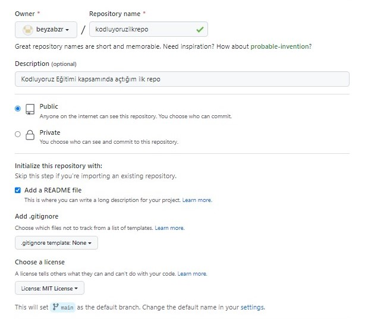

# Kodluyoruz Ilk Repo
Bu repo [Kodluyoruz](https://kodluyoruz.org/tr/kodluyoruz/) Front-End Eğitiminde oluşturduğumuz ilk repo. İçerisinde bir adet README dosyası, bir adet de index.html barındırıyor.


## Installation

Öncelikle projeyi clonelayın. 
```
https://github.com/beyzabzr/kodluyoruzilkrepo.git
 
```

## Usage

Projeyi cloneladıktan sonra Visual Studio Code programında açınız.
Linux için:
```linux
cd kodluyoruzilkrepo
code.
```
## Contributing

Pull requestler kabul edilir. Büyük değişiklikler için, lütfen önce neyi değiştirmek istediğiniz için bir kon açınız.

## Licence

[MIT](https://choosealicense.com/licenses/mit/)

## Patika profilim

[Patika](https://app.patika.dev/beyzabzrx)
